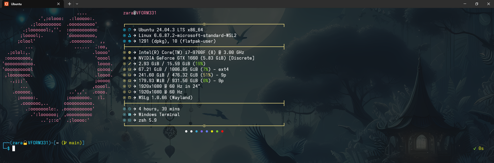

# Zsh config for WSL


Run the following command (Debian/Ubuntu) to install Zsh and other dependencies:

```bash
sudo apt install zsh zsh-autosuggestions zsh-syntax-highlighting fd-find ripgrep bat
```

Yous should also install the `fzf` and `eza` package.

> **_NOTE:_** the `fzf` and `eza` package on Ubuntu use an old version, it's better to install the latest version from Brew.

and git clone this repo in your `$HOME` directory.

```bash
cd ~
git init .
git remote add "origin" https://github.com/Chromiell/dotfiles-WSL.git
git fetch
git reset --hard origin/main
```

## Change default shell to Zsh

Run the following command to list all available shells:

```bash
cat /etc/shells
```

this should output a list of all available shells on the system, including `/bin/zsh`.

Change the default shell for the current user with:

```bash
chsh -s <shell>
```

---

You can also change the default shell for the `root` user by running the following command:

```bash
sudo chsh -s <shell>
```

## Install fastfetch (optional)

The zsh init script automatically runs `fastfetch`, if you don't have `fastfetch` installed it will throw an error. Since Debian Trixie `fastfetch` is present inside the default Debian repos, on Ubuntu and previous versions of Debian you have to manually install it. For Ubuntu systems you can install it by running:

```bash
sudo add-apt-repository ppa:zhangsongcui3371/fastfetch
sudo apt update
sudo apt install fastfetch
```

## Change settings to Windows terminal to display Nerd Fonts

Install the `AdwaitaMono Nerd Font Mono` from this repository: [https://github.com/ryanoasis/nerd-fonts/releases](https://github.com/ryanoasis/nerd-fonts/releases), download the `AdwaitaMono.zip` file, extract it and install all the fonts contained within.

Edit the JSON settings of Windows Terminal to the following:

```json
{
  "$help": "https://aka.ms/terminal-documentation",
  "$schema": "https://aka.ms/terminal-profiles-schema",
  "actions": [],
  "copyFormatting": "none",
  "copyOnSelect": false,
  "defaultProfile": "{3c87b3bb-e8d2-5ab7-9aa3-e26422320d80}",
  "keybindings": [
    {
      "id": "Terminal.CopyToClipboard",
      "keys": "ctrl+c"
    },
    {
      "id": "Terminal.PasteFromClipboard",
      "keys": "ctrl+v"
    },
    {
      "id": "Terminal.DuplicatePaneAuto",
      "keys": "alt+shift+d"
    }
  ],
  "launchMode": "maximized",
  "newTabMenu": [
    {
      "type": "remainingProfiles"
    }
  ],
  "profiles": {
    "defaults": {},
    "list": [
      {
        "commandline": "%SystemRoot%\\System32\\WindowsPowerShell\\v1.0\\powershell.exe",
        "guid": "{61c54bbd-c2c6-5271-96e7-009a87ff44bf}",
        "hidden": false,
        "name": "Windows PowerShell"
      },
      {
        "commandline": "%SystemRoot%\\System32\\cmd.exe",
        "guid": "{0caa0dad-35be-5f56-a8ff-afceeeaa6101}",
        "hidden": false,
        "name": "Prompt dei comandi"
      },
      {
        "guid": "{b453ae62-4e3d-5e58-b989-0a998ec441b8}",
        "hidden": false,
        "name": "Azure Cloud Shell",
        "source": "Windows.Terminal.Azure"
      },
      {
        "guid": "{c574aba2-052a-5ac8-b0a0-466475d6ea88}",
        "hidden": false,
        "name": "Developer Command Prompt for VS 2019 (2)",
        "source": "Windows.Terminal.VisualStudio"
      },
      {
        "guid": "{0ba87fa3-75bd-50fe-9918-f21b09e6bb4a}",
        "hidden": false,
        "name": "Developer PowerShell for VS 2019 (2)",
        "source": "Windows.Terminal.VisualStudio"
      },
      {
        "guid": "{66a15ef5-0b6e-54d8-bb90-22f707b257c2}",
        "hidden": true,
        "name": "Developer Command Prompt for VS 2019",
        "source": "Windows.Terminal.VisualStudio"
      },
      {
        "guid": "{96f7f63d-26b8-5e43-bcc4-6be4fa95c2a5}",
        "hidden": true,
        "name": "Developer PowerShell for VS 2019",
        "source": "Windows.Terminal.VisualStudio"
      },
      {
        "colorScheme": "Custom Scheme",
        "font": {
          "face": "AdwaitaMono Nerd Font Mono"
        },
        "guid": "{3c87b3bb-e8d2-5ab7-9aa3-e26422320d80}",
        "hidden": false,
        "name": "Ubuntu",
        "opacity": 80,
        "source": "Microsoft.WSL"
      },
      {
        "colorScheme": "Custom Scheme",
        "font": {
          "face": "AdwaitaMono Nerd Font Mono"
        },
        "guid": "{51855cb2-8cce-5362-8f54-464b92b32386}",
        "hidden": false,
        "name": "Ubuntu",
        "opacity": 80,
        "source": "CanonicalGroupLimited.Ubuntu_79rhkp1fndgsc"
      }
    ]
  },
  "schemes": [
    {
      "background": "#131313",
      "black": "#1A181A",
      "blue": "#647FF8",
      "brightBlack": "#707070",
      "brightBlue": "#22D5FF",
      "brightCyan": "#7ACCD7",
      "brightGreen": "#A4CD7C",
      "brightPurple": "#AB9DF2",
      "brightRed": "#F882A5",
      "brightWhite": "#E3E1E4",
      "brightYellow": "#E5D37E",
      "cursorColor": "#FFFFFF",
      "cyan": "#3AA5D0",
      "foreground": "#FFFFFF",
      "green": "#7FCD2B",
      "name": "Custom Scheme",
      "purple": "#7C63F2",
      "red": "#FF0E0E",
      "selectionBackground": "#FFFFFF",
      "white": "#ECECEC",
      "yellow": "#E4E713"
    }
  ],
  "themes": []
}
```
